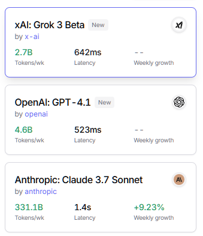
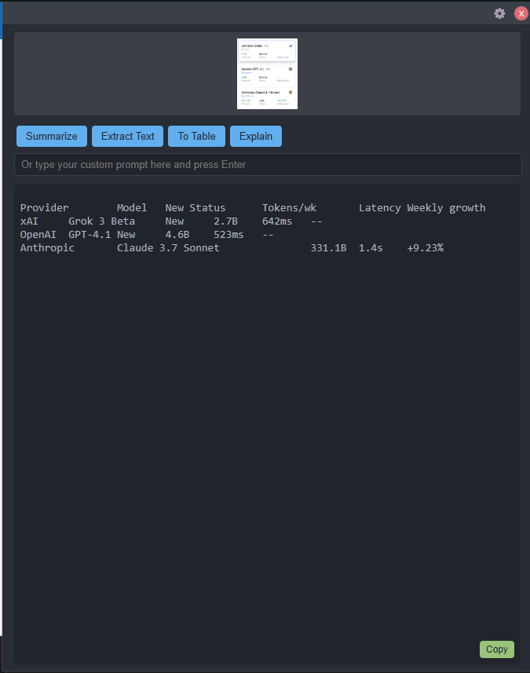
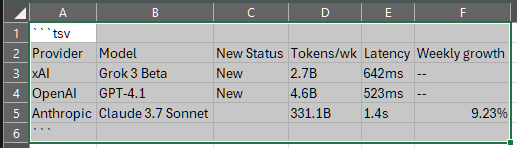
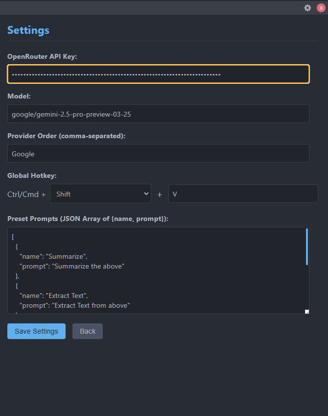

# GeminiPaste Helper

GeminiPaste Helper is a lightweight Electron application that runs in your system tray, allowing you to quickly process clipboard content (text, images, or even file contents) using AI models via the OpenRouter API. Press a hotkey, choose a prompt, and get AI-powered results copied back to your clipboard in seconds.

## Features

*   **System Tray Application:** Runs in the background with a tray icon for access and exit.
*   **Global Hotkey:** Activate the prompt window with a configurable keyboard shortcut (default: `Ctrl+Shift+V`).
*   **Multi-Format Clipboard Capture:** Automatically detects and captures text, images, or file paths from the clipboard.
    *   If a file path is detected, it attempts to read the content of text or image files directly.
*   **Contextual Prompt Window:** A small, always-on-top window appears showing the captured content and prompting for instructions.
*   **OpenRouter Integration:** Sends captured content and user prompts to the OpenRouter API.
    *   Requires a user-provided OpenRouter API key.
    *   Configurable AI model selection (defaults to a Gemini model).
*   **Preset & Custom Prompts:** Use predefined prompts or type custom instructions for the AI.
*   **Direct Result Copy:** Copy the AI's response directly back to the clipboard with a single click, closing the prompt window.
*   **Integrated Settings:** Configure API key, hotkey, model, provider order, and preset prompts within the prompt window. Settings are saved locally.

## Example

Let's say this is copied into your clipboard. in this case it's an image.


After pressing the hotkey, the prompt window appears. Here I've already pressed the "To table" canned prompt and the result is shown.


Since this is tab separated table, can paste into Excel directly.


Additional settings:



## Getting Started

### Prerequisites

*   Node.js and npm installed.
*   An OpenRouter API Key (sign up at [OpenRouter.ai](https://openrouter.ai/))

### Installation

1.  Clone the repository:
    ```bash
    git clone <repository-url>
    cd geminipaste
    ```
2.  Install dependencies:
    ```bash
    npm install
    ```

### Running the Application

1.  Start the application:
    ```bash
    npm start
    ```
2.  The application icon will appear in your system tray.
3.  **Important:** The first time you run it, or when you need to change settings:
    *   Activate the prompt window using the hotkey (default: `Ctrl+Shift+V`). You might need to copy some text first.
    *   Click the "Settings" button or icon within the prompt window.
    *   Enter your OpenRouter API Key.
    *   Configure the hotkey, model, and preset prompts as desired.
    *   Save the settings.

## How it Works

1.  **Run:** Start the app (`npm start`). It runs in the system tray.
2.  **Copy:** Copy text, an image, or a file path to your clipboard.
3.  **Hotkey:** Press the configured hotkey (e.g., `Ctrl+Shift+V`).
4.  **Prompt:** The prompt window appears with your clipboard content. Select a preset prompt or type a custom one. Click "Send".
5.  **Process:** The app sends the content and prompt to the configured OpenRouter model.
6.  **Result:** The AI's response appears in the prompt window.
7.  **Paste:** Click "Copy & Close". The response is copied to your clipboard, ready to paste.

## Building the Application

To build a portable executable:

```bash
npm run build
```

This will create an executable in the `dist` directory (configuration is in `package.json`).